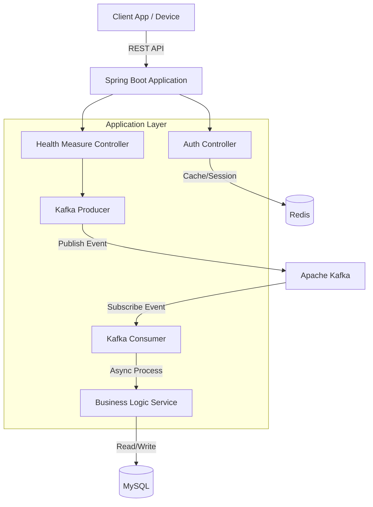

# 프로젝트 구조 및 아키텍처 설계서

## 1. 아키텍처 개요

본 프로젝트는 대용량 건강 데이터의 수집, 처리, 조회를 효율적으로 수행하기 위해 **이벤트 기반 아키텍처(Event-Driven Architecture)** 와 **계층형 아키텍처(Layered Architecture)** 를 혼합하여 설계되었습니다.

### 1.1. 시스템 구성도


### 1.2. 핵심 아키텍처 패턴
1.  **비동기 처리 (Asynchronous Processing)**:
    *   대량의 건강 데이터 업로드 요청 시, 서버는 데이터를 `HealthMeasureLog`에 1차 저장하고 즉시 응답을 반환합니다.
    *   실제 데이터 파싱 및 통계 집계는 **Kafka**를 통해 비동기적으로 처리되어, 사용자 응답 속도(Latency)를 보장하고 시스템 부하를 분산시킵니다.
2.  **CQRS (Command Query Responsibility Segregation)**:
    *   **Command (쓰기)**: `HealthMeasureLog`, `HealthMeasureInfo` 테이블에 데이터를 적재합니다.
    *   **Query (읽기)**: `HealthMeasureSummary` 테이블을 통해 미리 계산된 통계 데이터를 조회하여, 복잡한 집계 쿼리 없이 빠른 응답을 제공합니다.
3.  **Layered Architecture**:
    *   `Controller` (Presentation) -> `Service` (Business) -> `Repository` (Data Access)의 표준 계층 구조를 준수하여 유지보수성을 높였습니다.

---

## 2. 프로젝트 폴더 구조 (Project Directory Structure)

도메인 주도 설계(DDD)의 사상을 일부 차용하여, 기능을 도메인별 패키지로 응집시켰습니다.

```text
src/main/java/com/github/sunguk0810/assignment
├── AssignmentApplication.java   // 애플리케이션 진입점
├── domain                       // 핵심 비즈니스 도메인
│   ├── auth                     // [인증 도메인] 회원가입, 로그인, JWT
│   │   ├── constant             // Enum (RoleType 등)
│   │   ├── controller           // API 엔드포인트
│   │   ├── dto                  // 데이터 전송 객체 (Request/Response)
│   │   ├── entity               // JPA 엔티티 (User, UserProfile)
│   │   ├── repository           // 데이터 접근 계층
│   │   └── service              // 비즈니스 로직
│   └── health                   // [건강 도메인] 데이터 수집, 처리, 조회
│       ├── constant             // Enum (MeasureType, DataSourceType)
│       ├── controller           // 건강 데이터 API
│       ├── dto                  // 측정 데이터 DTO (Polymorphism 적용)
│       ├── entity               // Log, Info, Summary 엔티티
│       ├── event                // Kafka Producer/Consumer
│       ├── repository           // JPA & JdbcTemplate Repository
│       └── service              // 통계 조회 및 데이터 처리 로직
├── global                       // 전역 공통 모듈
│   ├── config                   // 설정 (Security, Web, Redis, Kafka)
│   │   ├── converter            // JPA Attribute Converter
│   │   ├── exception            // 전역 예외 처리 (GlobalExceptionHandler)
│   │   ├── filter               // Security Filter (JwtFilter)
│   │   └── security             // Spring Security 설정
│   ├── constant                 // 전역 Enum (ErrorType, StatusType)
│   ├── dto                      // 공통 DTO (ApiResponse, PageResponse)
│   ├── entity                   // BaseEntity (Audit)
│   └── util                     // 유틸리티 클래스
└── resources
    ├── application.yml          // 애플리케이션 설정
```
---

## 3. 데이터 파이프라인 흐름 (Data Pipeline Flow)

건강 데이터가 수집되어 통계에 반영되기까지의 흐름입니다.

1.  **데이터 수신**
    *   API: `POST /api/v1/health/measure`
    *   동작:
        1.  `HealthMeasureLog` 테이블에 Raw JSON 상태로 저장 (`PENDING`).
        2.  `health-measure-topic`으로 Kafka 메시지 발행 (Payload: Log ID).
        3.  Client에게 `200 OK` 응답 반환.

2.  **데이터 처리**
    *   Component: `HealthMeasureConsumer`
    *   동작:
        1.  Kafka 메시지 수신 (Log ID).
        2.  `HealthMeasureLog` 조회 및 JSON 파싱.
        3.  `HealthMeasureInfo` 테이블에 상세 데이터 저장 (중복 시 무시 - `INSERT IGNORE`).
        4.  `HealthMeasureSummary` 테이블의 일별 통계 데이터 갱신.
        5.  성공 시 Log 상태를 `DONE`으로 업데이트, 실패 시 `ERROR`로 업데이트.

3.  **데이터 조회**
    *   API: `GET /api/v1/health/measure`
    *   동작:
        1.  요청 파라미터(`type`, `date`) 검증.
        2.  `HealthMeasureSummary` 테이블에서 미리 계산된 데이터를 조회.
        3.  별도의 연산 없이 즉시 반환.

---

## 4. 기술 스택 및 버전 (Tech Stack)

| 구분 | 기술 | 버전 | 비고               |
| :--- | :--- | :--- |:-----------------|
| **Language** | Java | 17 | LTS 버전 사용        |
| **Framework** | Spring Boot | 4.0.1 |                  |
| **Build Tool** | Gradle | 8.x | Kotlin DSL 사용    |
| **Database** | MySQL | 8.0 | JSON Type 지원 활용  |
| **Cache** | Redis | 7.x | Refresh Token 저장소 |
| **Message Queue** | Apache Kafka | 3.x | 비동기 이벤트 처리       |
| **ORM** | Spring Data JPA | - | 기본 데이터 접근        |
| **Security** | Spring Security | 6.x | JWT 기반 인증        |

---

## 5. 주요 해결 과제 및 전략

1.  **대용량 트래픽 처리**: Kafka를 버퍼로 사용하여 DB 쓰기 부하를 조절(Backpressure)하고, 비동기 처리로 응답 속도를 확보했습니다.
2.  **데이터 정합성**: `measure_log_id`를 통해 원본 로그와 처리된 데이터 간의 추적성을 보장하고, 트랜잭션 범위 내에서 상태(`status`)를 관리하여 데이터 유실을 방지했습니다.
3.  **확장성 있는 데이터 구조**: `HealthDetail` 추상 클래스와 JSON 필드를 활용하여, 새로운 측정 타입(예: 수면, 스트레스)이 추가되더라도 DB 스키마 변경을 최소화했습니다.