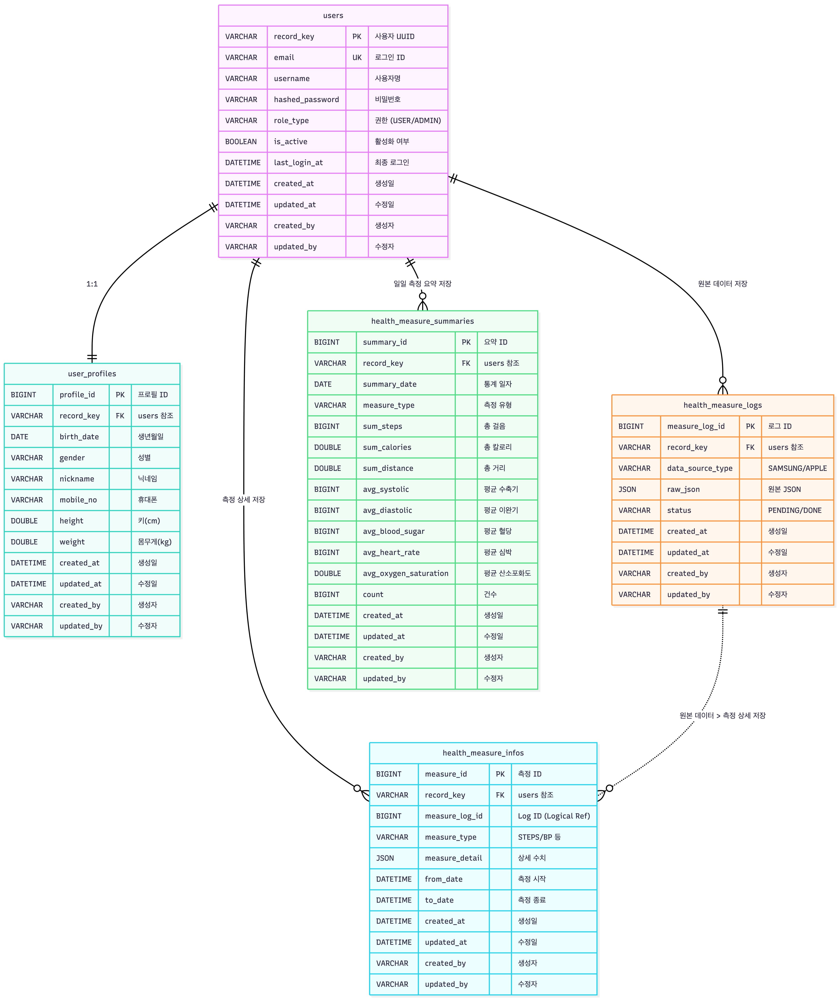

# 데이터베이스 설계서

## 1. 개요 및 설계 원칙

### 1.1. 설계 목표
- **유연성**: 다양한 제조사(Samsung, Apple 등)의 비정형 헬스 데이터를 수용하기 위해 반정형 데이터(JSON) 저장소를 활용합니다.
- **성능**: 대용량 시계열 데이터의 빠른 조회를 위해 **CQRS 패턴**을 적용, 쓰기 모델(`Log`, `Info`)과 읽기 모델(`Summary`)을 분리합니다.
- **무결성**: 중복 데이터 유입을 방지하고, 모든 데이터 변경 이력을 추적할 수 있도록 감사(Audit) 정보를 포함합니다.

### 1.2. 공통 사항
- **Audit Columns**: 모든 테이블은 `BaseEntity`를 상속받아 아래 4가지 감사 컬럼을 포함합니다.
  - `created_at`: 데이터 생성 일시
  - `updated_at`: 데이터 최종 수정 일시
  - `created_by`: 생성자 ID (User RecordKey)
  - `updated_by`: 수정자 ID

---

## 2. 상세 테이블 정의

### 2.1. 사용자 계정 (`users`)
> **설계 의도**: 사용자의 고유 식별자로 자동 증가형 Integer 대신 **UUID**를 채택했습니다. 이는 외부 노출 시 보안성을 높이기 위함입니다.

| 컬럼명 (Logical) | 컬럼명 (Physical) | 타입 | 제약조건 | 비고 |
| :--- | :--- | :--- | :--- | :--- |
| **사용자 ID** | `record_key` | `VARCHAR(255)` | **PK** | UUID (v4) 사용 |
| 이메일 | `email` | `VARCHAR(255)` | **UQ**, Not Null | 로그인 ID 역할 |
| 사용자명 | `username` | `VARCHAR(100)` | Not Null | |
| 비밀번호 | `hashed_password` | `VARCHAR(255)` | Not Null | BCrypt 암호화 저장 |
| 활성화 여부 | `is_active` | `BOOLEAN` | Not Null | Default: `true` |
| 권한 타입 | `role_type` | `VARCHAR(50)` | Not Null | `ROLE_USER` / `ROLE_ADMIN` |
| 마지막 로그인 | `last_login_at` | `DATETIME` | | |

### 2.2. 사용자 프로필 (`user_profiles`)
> **설계 의도**: 사용자의 정보(`users`)와 사용자 프로필(`user_profiles`)를 분리하여 1:1 관계로 설계했습니다. 이는 자주 조회되는 정보 테이블을 경량화하고, 필드가 유동적인 정보를 별도로 관리하기 위함입니다.

| 컬럼명 (Logical) | 컬럼명 (Physical) | 타입 | 제약조건 | 비고 |
| :--- | :--- | :--- | :--- | :--- |
| **프로필 ID** | `profile_id` | `BIGINT` | **PK**, AI | 내부 관리용 Sequence |
| 사용자 ID | `record_key` | `VARCHAR(255)` | **FK**, **UQ** | `users` 테이블 참조 |
| 생년월일 | `birth_date` | `DATE` | | |
| 성별 | `gender` | `VARCHAR(20)` | | `MAN`, `WOMAN` |
| 닉네임 | `nickname` | `VARCHAR(255)` | | |
| 휴대폰 번호 | `mobile_no` | `VARCHAR(50)` | | |
| 키 | `height` | `DOUBLE` | | cm 단위 |
| 몸무게 | `weight` | `DOUBLE` | | kg 단위 |

### 2.3. 건강 측정 로그 (`health_measure_logs`)
> **설계 의도**: **ELT(Extract-Load-Transform)** 파이프라인의 시작점입니다. 외부 API로부터 받은 원본(Raw) JSON을 가공 없이 즉시 저장하여 데이터 유실을 방지하고, 추후 파싱 로직이 변경되더라도 원본 데이터를 통해 재처리가 가능하도록 설계했습니다.

| 컬럼명 (Logical) | 컬럼명 (Physical) | 타입 | 제약조건 | 비고                                    |
| :--- | :--- | :--- | :--- |:--------------------------------------|
| **로그 ID** | `measure_log_id` | `BIGINT` | **PK**, AI |                                       |
| 사용자 ID | `record_key` | `VARCHAR(255)` | **FK** |                                       |
| 데이터 소스 | `data_source_type` | `VARCHAR(50)` | Not Null | `HEALTH_SAMSUNG`, `HEALTH_APPLE`, ... |
| 원본 데이터 | `raw_json` | `JSON` | | Payload 전체 저장                         |
| 처리 상태 | `status` | `VARCHAR(20)` | Not Null | `PENDING` → `DONE`/`ERROR`            |

### 2.4. 건강 측정 상세 (`health_measure_infos`)
> **설계 의도**: 로그 데이터를 정규화하여 저장하는 테이블입니다. 유연성을 위해 `measure_detail` 컬럼에 타입별 상세 속성(예: 혈압의 수축기/이완기)을 JSON으로 저장하되, **복합 유니크 인덱스**를 통해 동일 시간대의 중복 데이터 저장을 DB 레벨에서 차단합니다.

| 컬럼명 (Logical) | 컬럼명 (Physical) | 타입 | 제약조건 | 비고                             |
| :--- | :--- | :--- | :--- |:-------------------------------|
| **측정 ID** | `measure_id` | `BIGINT` | **PK**, AI |                                |
| 사용자 ID | `record_key` | `VARCHAR(255)` | **FK** |                                |
| 로그 ID | `measure_log_id` | `BIGINT` | |                                |
| 측정 타입 | `measure_type` | `VARCHAR(50)` | Not Null | `STEPS`, `BLOOD_PRESSURE`, ... |
| 상세 데이터 | `measure_detail` | `JSON` | | 타입별 스키마 상이                     |
| 시작 일시 | `from_date` | `DATETIME` | Not Null |                                |
| 종료 일시 | `to_date` | `DATETIME` | Not Null |                                |

**Constraint (Unique Key):**
- `UK_HEALTH_MEASURE_INFO`: `record_key` + `measure_type` + `from_date` + `to_date`

### 2.5. 건강 측정 요약 (`health_measure_summaries`)
> **설계 의도**: 통계 API 호출 시마다 수만 건의 `infos` 데이터를 `GROUP BY` 하는 것은 비효율적입니다. 따라서 데이터 수집 시점(Kafka Consumer)에 실시간으로 일별 통계를 미리 계산(Pre-aggregation)하여 저장하는 테이블입니다.

| 컬럼명 (Logical) | 컬럼명 (Physical) | 타입 | 제약조건 | 비고 |
| :--- | :--- | :--- | :--- | :--- |
| **요약 ID** | `summary_id` | `BIGINT` | **PK**, AI | |
| 사용자 ID | `record_key` | `VARCHAR(255)` | **FK** | |
| 요약 일자 | `summary_date` | `DATE` | Not Null | `YYYY-MM-DD` |
| 측정 타입 | `measure_type` | `VARCHAR(50)` | Not Null | |
| 총 걸음 수 | `sum_steps` | `BIGINT` | | 집계 필드 |
| 총 칼로리 | `sum_calories` | `DOUBLE` | | 집계 필드 |
| 총 거리 | `sum_distance` | `DOUBLE` | | 집계 필드 |
| 평균 수축기 | `avg_systolic` | `BIGINT` | | 집계 필드 (혈압) |
| 평균 이완기 | `avg_diastolic` | `BIGINT` | | 집계 필드 (혈압) |
| 평균 혈당 | `avg_blood_sugar` | `BIGINT` | | 집계 필드 |
| 평균 심박수 | `avg_heart_rate` | `BIGINT` | | 집계 필드 |
| 평균 산소포화도 | `avg_oxygen_saturation` | `DOUBLE` | | 집계 필드 |
| 측정 건수 | `count` | `BIGINT` | | 평균 계산용 분모 |

---

## 3. ERD

아래 다이어그램은 테이블 간의 물리적/논리적 관계를 시각화합니다.

### 관계 설명
1.  **Users ↔ UserProfiles (1:1)**:
    *   사용자 생성 시 프로필이 필수는 아니지만, 서비스 로직 상 함께 생성되는 구조입니다.
    *   `record_key`를 FK이자 식별 키로 사용하여 1:1 관계를 강제합니다.

2.  **Users ↔ Logs/Infos/Summaries (1:N)**:
    *   한 명의 사용자는 다수의 측정 로그, 상세 데이터, 요약 데이터를 가집니다.
    *   모든 하위 테이블은 `record_key`를 포함하여 특정 사용자의 데이터를 조회 및 집계할 수 있습니다.

3.  **Logs ⇢ Infos**:
    *   `health_measure_infos`는 `health_measure_logs`의 ID를 가지고 있습니다.
    *   이는 **"어떤 원본 로그로부터 이 상세 데이터가 파생되었는가?"** 를 추적(Tracing)하기 위함입니다. 다만, 로그 데이터가 삭제되더라도 상세 데이터는 유지되어야 하므로 물리적 FK 제약조건은 설정하지 않았습니다.
